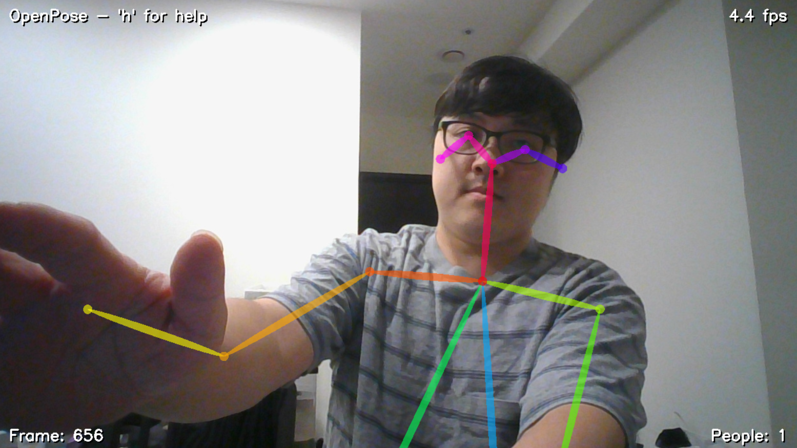
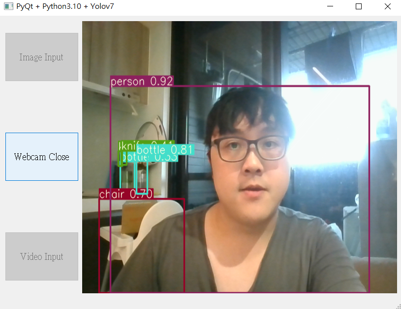
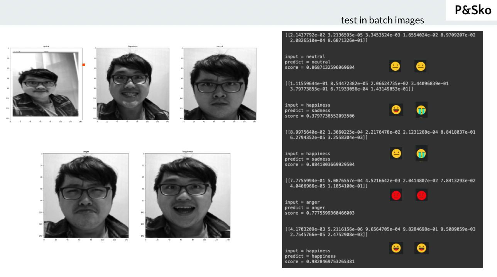

# Brief

  The repos is to show the implementation of AI and 3D.   
  AI is a trend for the nex-gen vision based technologies.     
  The repos is also included with 3D + AI net such as pointnet, pointnet++, modelnet, VGG16 implementation or framework introduction.   
  The repos is also included with 3D domain implementation or framework introduction.   
 
# Action items
  
  0. to publish my work-out article in Medium ["How to start learinng AI?"](https://dccheng.medium.com/how-to-start-learning-ai-a3c003d38d41)
  1. to visulize skeleton detection with rgb webcam in `./repos/skeleton_detection-1`
  2. to visulize people detection with rgb webcam in `./repos/yolo-1`
  3. to run a pre-trained model of Kaggle: Facial-Emotional-Recognication: `./repos/fer`

# Collection

  1. skeleton detection (OpenPose)
     
  2. people/object detection (Yolo)
     
  3. facial emotional detection (Kaggle, DCNN)
     
  4. ...
     
# Reference 

  - [PCLibrary](https://pcl.readthedocs.io/en/latest/)
  - [Yolov7](https://zhuanlan.zhihu.com/p/591886995)
  - [Open3D](https://github.com/isl-org/Open3D)
  - [Open3D-ML](https://github.com/isl-org/Open3D-ML)
  - ...

# Action items (TBD)

  - how to use 3D + AI ? `Poinet`, `Poinet++`, `Modelnet40`, `Modelnet10`, ... ?
  - more CNN AI ? `LeNet50`, `Alexnet`, `ImageNet`, ... , `VGG16` ... ?
